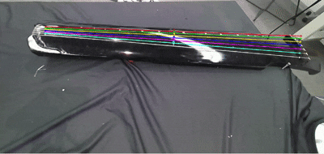

# Guqin String Detection with Azure Kinect and ROS2

本项目用于使用 Azure Kinect DK 和 ROS2 对古琴琴弦进行实时视觉检测。系统从 Kinect RGB 图像中分割琴弦，实时拟合 7 根琴弦的 2D 端点，并可结合 Kinect 对齐深度图发布相机坐标系下的 3D 琴弦线段。

## Demo



## Repository Structure

```text
.
├── Azure_Kinect_ROS2_Driver/
│   ├── launch/
│   │   ├── k4a_device_launch.py
│   │   └── k4a_guqin_realtime_launch.py
│   ├── scripts/
│   │   ├── guqin_string_realtime_node.py
│   │   └── guqin_strings_3d_node.py
│   └── azure_kinect_ros2_driver/
│       └── guqin_runtime.py
├── SAM_guqin/
│   ├── eval.py
│   ├── mask_to_strings.py
│   ├── strings_realtime.py
│   └── train.py
├── 检测效果.gif
└── README.md
```

核心文件：

- `guqin_string_realtime_node.py`：ROS2 2D 琴弦实时检测节点
- `guqin_strings_3d_node.py`：基于 Kinect 深度图的 3D 琴弦定位节点
- `guqin_runtime.py`：连接 ROS2 节点和 `SAM_guqin` 推理/跟踪代码的运行时封装
- `eval.py`：UNet 权重加载和图像推理
- `strings_realtime.py`：琴弦实时标定、跟踪、平移/旋转恢复和平滑
- `mask_to_strings.py`：mask 到 7 根琴弦线段的完整拟合逻辑
- `train.py`：UNet 训练和微调脚本

## Requirements

推荐环境：

- Ubuntu 22.04
- ROS2 Humble
- Azure Kinect DK
- Azure Kinect Sensor SDK
- Python 3.10
- CUDA GPU 可选；CPU 可运行但实时性能会下降

ROS2 依赖：

```bash
sudo apt update
sudo apt install -y \
  ros-humble-cv-bridge \
  ros-humble-image-transport \
  ros-humble-image-pipeline \
  ros-humble-rqt-image-view \
  ros-humble-tf2-ros
```

Python 依赖：

```bash
python3 -m pip install --user \
  opencv-python \
  numpy \
  torch \
  torchvision \
  segmentation-models-pytorch \
  albumentations \
  pillow \
  scipy \
  scikit-image \
  matplotlib
```

Azure Kinect Sensor SDK 安装完成后，建议先用下面命令确认相机可用：

```bash
k4aviewer
```

## Clone and Build

创建 ROS2 workspace：

```bash
mkdir -p ~/guqin_ws/src
cd ~/guqin_ws/src
git clone https://github.com/lyxiner/guqin-string-detection.git
```

构建：

```bash
cd ~/guqin_ws
source /opt/ros/humble/setup.bash
colcon build --symlink-install --packages-select azure_kinect_ros2_driver
```

每个新终端都需要加载环境：

```bash
source /opt/ros/humble/setup.bash
source ~/guqin_ws/install/setup.bash
```

## Model Weights

本仓库不直接提交 `.pth` 权重文件。运行实时检测前，需要把训练好的权重放到：

```text
~/guqin_ws/src/guqin-string-detection/SAM_guqin/checkpoints/guqin_best.pth
```

可以下载作者提供的示例权重：

```bash
cd ~/guqin_ws/src/guqin-string-detection
mkdir -p SAM_guqin/checkpoints
wget -O SAM_guqin/checkpoints/guqin_best.pth \
  https://huggingface.co/Spring14th/guqin_model/resolve/main/guqin_best.pth
```

也可以在启动检测节点时手动指定权重路径：

```bash
ros2 run azure_kinect_ros2_driver guqin_string_realtime_node.py --ros-args \
  -p checkpoint_path:=/path/to/guqin_best.pth
```

如果你重新训练了模型，只需要把新的 `guqin_best.pth` 放到 `SAM_guqin/checkpoints/`，或用 `checkpoint_path` 参数指向新权重。

## Quick Start

### 2D Detection Only

终端 1：启动 Kinect。

```bash
source /opt/ros/humble/setup.bash
source ~/guqin_ws/install/setup.bash
ros2 launch azure_kinect_ros2_driver k4a_device_launch.py
```

终端 2：启动琴弦检测节点。

```bash
source /opt/ros/humble/setup.bash
source ~/guqin_ws/install/setup.bash
ros2 run azure_kinect_ros2_driver guqin_string_realtime_node.py
```

默认输入：

```text
/k4a/rgb/image_raw
```

默认输出：

```text
/guqin/strings_mask
/guqin/strings_overlay
/guqin/strings_fit_json
```

### 2D + 3D Detection

一键启动 Kinect、2D 检测和 3D 定位：

```bash
source /opt/ros/humble/setup.bash
source ~/guqin_ws/install/setup.bash
ros2 launch azure_kinect_ros2_driver k4a_guqin_realtime_launch.py
```

该 launch 默认使用：

```text
inference_mode=resize
target_frame=rgb_camera_link
```

3D 节点默认输入：

```text
/guqin/strings_fit_json
/k4a/depth_to_rgb/image_raw
/k4a/rgb/camera_info
```

默认输出：

```text
/guqin/strings_3d_json
/guqin/strings_3d_markers
```

3D 坐标默认发布在 `rgb_camera_link` 坐标系下，单位为米。

## View Results

查看叠加图：

```bash
ros2 run rqt_image_view rqt_image_view
```

在界面中选择：

```text
/guqin/strings_overlay
```

注意：为了降低负载，`/guqin/strings_overlay` 只有在有订阅者时才会绘制和发布。打开 `rqt_image_view` 后才会看到 overlay 图像。

查看 mask：

```text
/guqin/strings_mask
```

查看 2D JSON：

```bash
ros2 topic echo /guqin/strings_fit_json --once --full-length
```

查看 3D JSON：

```bash
ros2 topic echo /guqin/strings_3d_json --once --full-length
```

查看发布频率：

```bash
ros2 topic hz /guqin/strings_fit_json
ros2 topic hz /guqin/strings_3d_json
```

节点日志会定期输出处理耗时和跟踪状态，例如：

```text
frame=120 seg=38ms track=4ms stale=52ms roi=1 inliers=0.96 shift=+0px
```

字段含义：

- `seg`：分割耗时
- `track`：琴弦拟合/跟踪耗时
- `stale`：当前处理帧相对相机时间戳的延迟
- `roi`：是否使用 ROI 推理
- `inliers`：跟踪内点比例，越高越稳定
- `shift`：tracker 自动应用的整体平移补偿

## Output Format

### 2D Strings

`/guqin/strings_fit_json` 是 `std_msgs/String`，内容为 JSON 字符串。单根弦示例：

```json
{
  "string_id": 1,
  "p_start_uv": [120.0, 350.0],
  "p_end_uv": [1180.0, 340.0],
  "track_a": -0.01,
  "track_b": 351.2
}
```

其中 `u` 是图像列坐标，`v` 是图像行坐标，图像原点在左上角。JSON 中还包含运行状态字段，如 `inlier_ratio`、`seg_ms`、`track_ms`、`used_roi`、`shift_applied_px`。

### 3D Strings

`/guqin/strings_3d_json` 中单根弦示例：

```json
{
  "string_id": 1,
  "frame_id": "rgb_camera_link",
  "p_start": [0.12, -0.08, 1.05],
  "p_end": [0.84, -0.07, 1.06],
  "p_mid": [0.48, -0.075, 1.055],
  "direction_unit": [0.999, 0.01, 0.02],
  "length_m": 0.72,
  "valid_samples": 18,
  "inlier_samples": 17,
  "rejected_samples": 1,
  "total_samples": 21,
  "valid_sample_ratio": 0.85,
  "line_rms_m": 0.008
}
```

质量判断建议：

- `valid_sample_ratio` 越高，深度采样越完整
- `inlier_samples` 越多，直线拟合越稳定
- `line_rms_m` 越小，3D 点越接近同一条直线

## Training and Fine-Tuning

如果现场光照、相机角度、琴弦颜色或古琴外观变化较大，可以准备自己的数据继续训练。

### Dataset Layout

`train.py` 需要图片和二值 mask 按文件名配对：

```text
SAM_guqin/
├── GuQin/
│   ├── example_001.jpg
│   └── example_002.jpg
├── masks_strings/
│   ├── example_001_mask.png
│   └── example_002_mask.png
└── checkpoints/
```

mask 要求：

- 单通道二值图
- 白色像素表示琴弦
- 黑色像素表示背景
- 文件名格式为 `{image_stem}_mask.png`

如果你使用 LabelMe 标注，建议用 `line` 标注每根琴弦，然后将标注转换为上述 `*_mask.png` 格式。

### Train From Scratch

```bash
cd ~/guqin_ws/src/guqin-string-detection/SAM_guqin
python3 train.py \
  --image_dir ./GuQin \
  --mask_dir ./masks_strings \
  --save_dir ./checkpoints
```

训练完成后，最优权重保存为：

```text
SAM_guqin/checkpoints/guqin_best.pth
```

### Fine-Tune Existing Weights

如果已经有可用的 `guqin_best.pth`，建议基于它微调：

```bash
cd ~/guqin_ws/src/guqin-string-detection/SAM_guqin
python3 train.py \
  --image_dir ./GuQin \
  --mask_dir ./masks_strings \
  --save_dir ./checkpoints \
  --init_checkpoint ./checkpoints/guqin_best.pth \
  --epochs 50 \
  --lr 5e-5
```

### Test a Checkpoint

```bash
cd ~/guqin_ws/src/guqin-string-detection/SAM_guqin
python3 eval.py \
  --ckpt ./checkpoints/guqin_best.pth \
  --image ./eval01.jpg \
  --mode resize \
  --threshold 0.5
```

## Runtime Modes

推荐从默认配置开始：

```bash
ros2 run azure_kinect_ros2_driver guqin_string_realtime_node.py
```

如果需要更高的分割精度，可以尝试 `sliding`，但延迟会明显增加：

```bash
ros2 run azure_kinect_ros2_driver guqin_string_realtime_node.py --ros-args \
  -p inference_mode:=sliding
```

如果琴或相机在运行中会移动，推荐定期重标定：

```bash
ros2 run azure_kinect_ros2_driver guqin_string_realtime_node.py --ros-args \
  -p force_recalibrate_every_n:=10
```

如果调试拟合精度，可以打开每帧完整重标定：

```bash
ros2 run azure_kinect_ros2_driver guqin_string_realtime_node.py --ros-args \
  -p always_recalibrate:=true
```

如果 ROI 推理在某些画面中裁掉琴弦，可以关闭 ROI：

```bash
ros2 run azure_kinect_ros2_driver guqin_string_realtime_node.py --ros-args \
  -p roi_inference:=false
```

## Node Parameters

### `guqin_string_realtime_node.py`

| Parameter | Default | Description |
| --- | --- | --- |
| `image_topic` | `/k4a/rgb/image_raw` | 输入 RGB 图像话题 |
| `sam_guqin_dir` | 自动查找 `SAM_guqin` | 推理代码目录 |
| `checkpoint_path` | `SAM_guqin/checkpoints/guqin_best.pth` | UNet 权重路径 |
| `inference_mode` | `resize` | 推理模式，支持 `resize` 或 `sliding`；`resize` 更快 |
| `mask_threshold` | `0.5` | 分割阈值 |
| `expected_strings` | `7` | 期望琴弦数量 |
| `always_recalibrate` | `false` | 每个有效帧都重新完整拟合琴弦，最稳但更慢 |
| `force_recalibrate_every_n` | `0` | 每 N 个有效帧强制重新完整拟合一次，0 表示关闭 |
| `tracker_max_inlier_dist_px` | `8.0` | tracker 给采样点分配琴弦时允许的最大像素偏差 |
| `tracker_recal_inlier_threshold` | `0.7` | tracker 内点比例低于该值时触发重新标定 |
| `roi_inference` | `true` | 跟踪稳定后只对琴弦 ROI 分割，并在异常时回退全图 |
| `roi_inference_pad_px` | `100` | ROI 外扩像素 |
| `lock_theta_on_recalibration` | `true` | 重标定时用 PCA 快速估计主方向，避免慢速 Hough |
| `tracker_smoothing_alpha` | `0.6` | 静止帧的 EMA 平滑系数；越小越稳，越大越灵敏 |
| `publish_mask_topic` | `/guqin/strings_mask` | 输出 mask 话题 |
| `publish_overlay_topic` | `/guqin/strings_overlay` | 输出叠加图话题 |
| `publish_json_topic` | `/guqin/strings_fit_json` | 输出 2D JSON 话题 |
| `debug_overlay_dir` | 空 | 可选调试图保存目录 |
| `save_debug_every_n` | `0` | 每 N 帧保存一张调试图，0 表示关闭 |

### `guqin_strings_3d_node.py`

| Parameter | Default | Description |
| --- | --- | --- |
| `backend` | `depth_image` | 3D 数据来源，支持 `depth_image` 或 `point_cloud` |
| `fit_json_topic` | `/guqin/strings_fit_json` | 输入 2D 琴弦 JSON |
| `depth_image_topic` | `/k4a/depth_to_rgb/image_raw` | 对齐到 RGB 的深度图 |
| `camera_info_topic` | `/k4a/rgb/camera_info` | RGB 相机内参 |
| `target_frame` | `rgb_camera_link` | 输出坐标系 |
| `publish_json_topic` | `/guqin/strings_3d_json` | 输出 3D JSON 话题 |
| `publish_marker_topic` | `/guqin/strings_3d_markers` | 输出 RViz marker 话题 |
| `samples_per_string` | `21` | 每根弦采样点数量 |
| `search_radius_px` | `3` | 深度缺失时搜索邻近像素的半径 |
| `min_valid_samples` | `5` | 拟合一根弦所需最少有效 3D 点 |
| `outlier_threshold_m` | `0.02` | RANSAC 离群点阈值 |
| `max_line_rms_m` | `0.02` | 允许发布的最大直线拟合 RMS |
| `publish_on_depth` | `true` | 是否在深度帧到来时用最新 2D 结果刷新 3D 输出 |
| `publish_rate_hz` | `10.0` | 3D 输出限频 |

## Troubleshooting

### Kinect cannot be opened

先确认 Azure Kinect SDK 和 USB 连接：

```bash
k4aviewer
```

如果 `k4aviewer` 无法打开设备，先排查供电、USB 连接、udev 权限和 SDK 安装。

### No `/k4a/rgb/image_raw`

检查相机节点：

```bash
ros2 topic list | grep k4a
```

单独启动 Kinect：

```bash
ros2 launch azure_kinect_ros2_driver k4a_device_launch.py
```

### No `/guqin/strings_fit_json`

依次检查：

```bash
ros2 topic hz /k4a/rgb/image_raw
ros2 node list
ros2 topic list | grep guqin
```

常见原因：

- `guqin_best.pth` 不存在或路径不正确
- Python 依赖没有安装完整
- 输入图像话题名称不一致
- 画面中琴弦太暗、反光太强或琴弦区域太小

### Mask looks good but overlay lines are wrong

如果 `/guqin/strings_mask` 看起来正常，但 `/guqin/strings_overlay` 中 7 根拟合线错位或串线，通常说明分割模型没有问题，问题在 mask 到线段的拟合/跟踪阶段。

先用每帧完整重标定确认完整拟合是否可靠：

```bash
ros2 run azure_kinect_ros2_driver guqin_string_realtime_node.py --ros-args \
  -p always_recalibrate:=true
```

如果这样 overlay 变准，说明模型和 mask 是可用的。实时运行时可改成定期重标定：

```bash
ros2 run azure_kinect_ros2_driver guqin_string_realtime_node.py --ros-args \
  -p force_recalibrate_every_n:=5
```

如果琴移动后 ROI 可能裁掉琴弦，可关闭 ROI 测试：

```bash
ros2 run azure_kinect_ros2_driver guqin_string_realtime_node.py --ros-args \
  -p roi_inference:=false
```

如果仍然偶发串线，可提高 tracker 的重标定敏感度：

```bash
ros2 run azure_kinect_ros2_driver guqin_string_realtime_node.py --ros-args \
  -p tracker_recal_inlier_threshold:=0.9
```

### Overlay topic has no image

`/guqin/strings_overlay` 为按需发布。请先启动订阅者：

```bash
ros2 run rqt_image_view rqt_image_view
```

然后选择 `/guqin/strings_overlay`。如果没有订阅者，节点不会绘制 overlay，以节省计算和序列化开销。

### No `/guqin/strings_3d_json`

检查 2D 结果、深度图和相机内参：

```bash
ros2 topic hz /guqin/strings_fit_json
ros2 topic hz /k4a/depth_to_rgb/image_raw
ros2 topic echo /k4a/rgb/camera_info --once
```

默认 `target_frame` 是 `rgb_camera_link`。如果改成其他坐标系，需要保证 TF 树里存在从 Kinect frame 到目标 frame 的变换。
